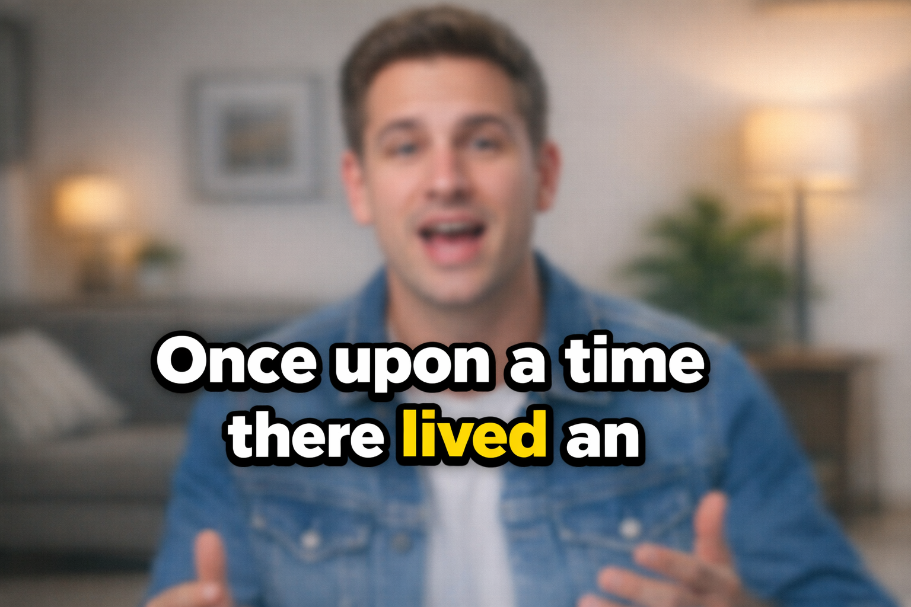
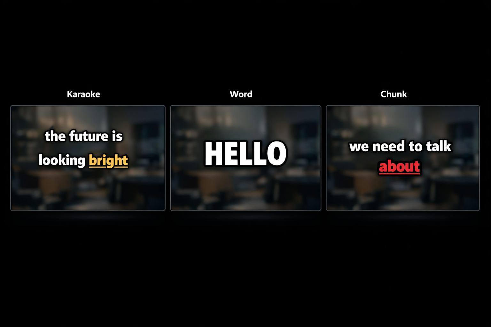

<h1 align="center">Magic Hour Dynamic Subtitles</h1>

<p align="center">
  <strong>TikTok-style animated subtitle generator for video.</strong><br>
  Transcribes speech locally with faster-whisper, then burns in bold, outlined, word-highlighted subtitles.
</p>

<p align="center">
  <a href="#installation">Install</a> &bull;
  <a href="#quick-start">Quick Start</a> &bull;
  <a href="#display-modes">Modes</a> &bull;
  <a href="#full-cli-reference">CLI Reference</a> &bull;
  <a href="#pre-built-binaries">Download Binaries</a>
</p>

<p align="center">
  
  
  
  
</p>

---

<p align="center">
  
</p>

**Zero system dependencies** -- FFmpeg is bundled via pip. Just install and run.

---

## Table of Contents

- [Installation](#installation)
- [Pre-built Binaries](#pre-built-binaries)
- [Quick Start](#quick-start)
- [Display Modes](#display-modes)
- [Platform Presets](#platform-presets)
- [Styling Options](#styling-options)
- [Highlight Size (Pop Effect)](#highlight-size-pop-effect)
- [Vertical Position](#vertical-position)
- [Transcription Options](#transcription-options)
- [Transcript Alignment](#transcript-alignment)
- [Output Options](#output-options)
- [Full CLI Reference](#full-cli-reference)
- [Examples](#examples)
- [How It Works](#how-it-works)
- [Requirements](#requirements)

---

## Installation

```bash
pip install -r requirements.txt
```

That's it. FFmpeg is included via `imageio-ffmpeg` (no separate install needed). The tool also bundles Montserrat ExtraBold as the default font.

Or install as a package for a system-wide `magic-hour-subtitles` command:

```bash
pip install .
magic-hour-subtitles my_video.mp4
```

---

## Pre-built Binaries

Standalone executables (no Python required) are available on the [Releases](../../releases) page:

| Platform | Download |
|----------|----------|
| Windows | `magic-hour-subtitles-windows.exe` |
| macOS | `magic-hour-subtitles-macos` |
| Linux | `magic-hour-subtitles-linux` |

Download the binary for your platform, then run it directly:

```bash
# Windows
magic-hour-subtitles-windows.exe my_video.mp4 -o output.mp4

# macOS / Linux (make executable first)
chmod +x magic-hour-subtitles-linux
./magic-hour-subtitles-linux my_video.mp4 -o output.mp4
```

All dependencies (Python, FFmpeg, fonts) are bundled inside the binary.

---

## Quick Start

```bash
python -m magic_hour_subtitles my_video.mp4
```

This will:

1. Extract audio from the video
2. Transcribe it locally with faster-whisper (word-level timestamps)
3. Render karaoke-style subtitles (words build up line by line, current word highlighted in gold)
4. Output `my_video_subtitled.mp4` in the same directory

To specify an output filename:

```bash
python -m magic_hour_subtitles my_video.mp4 -o output.mp4
```

---

## Display Modes

<p align="center">
  
</p>

Three subtitle animation modes are available via `--mode`:

### `karaoke` (default)

Words appear one at a time, building up lines. The currently spoken word is highlighted in a different color. After the configured number of lines fills up, the page clears and new lines begin.

```bash
python -m magic_hour_subtitles video.mp4 --mode karaoke
```

What it looks like on screen (over time):

```
Frame 1:  "Once"                    (Once = highlighted)
Frame 2:  "Once upon"               (upon = highlighted)
Frame 3:  "Once upon a"             (a = highlighted)
Frame 4:  "Once upon a time"        (time = highlighted)
Frame 5:  "Once upon a time"        (There = highlighted, new line)
          "There"
...after --max-lines lines, page clears and restarts
```

**Key options for karaoke mode:**

- `--words-per-line 4` -- force exactly 4 words per line (default: auto-calculated from font size and video width)
- `--max-lines 3` -- clear the page after 3 lines (default: 3)

### `word`

One word at a time, centered on screen. Each word is visible for exactly its spoken duration. Clean and punchy -- great for dramatic or fast-paced content.

<p align="center">
  
</p>

```bash
python -m magic_hour_subtitles video.mp4 --mode word
```

### `chunk`

Shows a block of N words at a time. Within each chunk, the currently spoken word is highlighted. When all words in the chunk have been spoken, the next chunk appears.

```bash
python -m magic_hour_subtitles video.mp4 --mode chunk --words-per-chunk 4
```

**Key options for chunk mode:**

- `--words-per-chunk 4` -- show 4 words per chunk (default: 3)

---

## Platform Presets

Apply platform-tuned defaults with a single flag. Presets configure font size, position, colors, outline width, and line count for each platform's style conventions.

```bash
python -m magic_hour_subtitles video.mp4 --preset tiktok
python -m magic_hour_subtitles video.mp4 --preset reels
python -m magic_hour_subtitles video.mp4 --preset shorts
```

| Preset | Font Size | Position | Highlight Color | Max Lines |
|--------|-----------|----------|-----------------|-----------|
| `tiktok` | 5% of height | lower | Gold (#FFD700) | 3 |
| `reels` | 4.8% of height | lower | Cyan (#00E5FF) | 3 |
| `shorts` | 4.5% of height | center | Yellow (#FFEB3B) | 2 |

You can override any individual setting on top of a preset:

```bash
python -m magic_hour_subtitles video.mp4 --preset tiktok --highlight-color "#FF4444" --position center
```

---

## Styling Options

All colors are specified as hex strings (e.g., `#FFFFFF`).

| Option | Default | Description |
|--------|---------|-------------|
| `--font PATH` | Montserrat ExtraBold (bundled) | Path to any .ttf font file |
| `--font-size INT` | ~5% of video height | Font size in pixels |
| `--font-color HEX` | `#FFFFFF` (white) | Base text color |
| `--highlight-color HEX` | `#FFD700` (gold) | Color for the currently spoken word |
| `--outline-color HEX` | `#000000` (black) | Thick outline/stroke color |
| `--outline-width INT` | `5` | Outline thickness in pixels |
| `--shadow-color HEX` | `#000000` (black) | Drop shadow color |
| `--shadow-offset INT` | `2` | Shadow offset in pixels |
| `--uppercase` | off | Render all text in UPPERCASE |
| `--no-highlight` | off | Disable word highlighting (all words same color) |

---

## Highlight Size (Pop Effect)

Use `--highlight-size` to make the currently spoken word render at a larger font size, creating a "pop" effect. The highlighted word scales up and is vertically centered with the rest of the line.

```bash
python -m magic_hour_subtitles video.mp4 --font-size 100 --highlight-size 130
```

This renders normal words at 100px and the active word at 130px. Works in all modes (karaoke, word, chunk).

---

## Vertical Position

Five vertical anchor points are available via `--position`:

| Position | Where it sits | Y anchor |
|----------|---------------|----------|
| `top` | Near the top edge | 10% from top |
| `upper` | Upper third | 25% from top |
| `center` | Vertical midpoint | 50% |
| `lower` | Lower third **(default)** | 75% from top |
| `bottom` | Near the bottom edge | 90% from top |

```bash
python -m magic_hour_subtitles video.mp4 --position center
python -m magic_hour_subtitles video.mp4 --position top --margin-y 50
```

**Margin options:**

| Option | Default | Description |
|--------|---------|-------------|
| `--margin-x INT` | 10% of video width | Horizontal padding from edges (defines subtitle area width) |
| `--margin-y INT` | 5% of video height | Vertical offset for top/bottom anchors |

---

## Transcription Options

| Option | Default | Description |
|--------|---------|-------------|
| `--language CODE` | `en` | ISO-639-1 language code (e.g., `en`, `es`, `fr`, `ja`) |
| `--whisper-prompt TEXT` | none | Pronunciation guide for Whisper |
| `--transcript PATH` | none | Path to a text file with the correct script |

### Pronunciation Guide (`--whisper-prompt`)

Whisper's prompt parameter helps with uncommon names, technical terms, and brand names. It works by style imitation -- Whisper tries to produce output that reads like the prompt -- so provide examples of the correct spellings:

```bash
python -m magic_hour_subtitles video.mp4 --whisper-prompt "ZyntriQix, Acme Corp, Dr. Martinez"
```

The prompt is limited to ~224 tokens (~500 characters). Best for short lists of key terms.

---

## Transcript Alignment

For videos where Whisper consistently misrecognizes words (background music, heavy accents, technical content), you can provide the full correct transcript. Instead of feeding it to Whisper as a prompt (which can cause hallucinations), the tool:

1. Lets Whisper transcribe naturally to get accurate **timing**
2. Aligns Whisper's output to your script using sequence matching to get accurate **text**
3. Replaces misheard words with the correct script text while keeping Whisper's timestamps
4. Drops hallucinated words (words Whisper heard that aren't in your script)
5. Preserves the original speech timing, including intentional pauses

```bash
python -m magic_hour_subtitles video.mp4 --transcript script.txt
```

Where `script.txt` contains the spoken dialogue:

```
Right, so mostly I'm leaving the timeline as-is.
I'm just going to adjust the color grading
before the light gets harsh.
```

**Notes on transcript alignment:**

- The transcript should contain only the **spoken dialogue**, not descriptions of music or sound effects
- Word order matters -- the aligner matches sequences, so the script should follow the order words are spoken
- It's OK if the transcript isn't word-perfect -- the sequence matcher handles minor differences
- Words in your script that Whisper didn't detect at all are skipped (no timing available)

---

## Output Options

| Option | Description |
|--------|-------------|
| `-o, --output PATH` | Output video path. Default: `<input>_subtitled.mp4` |
| `--export-srt` | Also export an `.srt` subtitle file alongside the video |

---

## Full CLI Reference

```
Usage: python -m magic_hour_subtitles [OPTIONS] INPUT_VIDEO

Options:
  -o, --output FILE               Output video path
  --mode [karaoke|word|chunk]     Subtitle display mode [default: karaoke]
  --words-per-line INTEGER        Fixed words per line (auto if omitted)
  --max-lines INTEGER             Max lines per page [default: 3]
  --words-per-chunk INTEGER       Words per chunk [default: 3]
  --font PATH                     Path to a .ttf font file
  --font-size INTEGER             Font size in pixels
  --font-color TEXT               Text color as hex [default: #FFFFFF]
  --highlight-color TEXT          Highlight color [default: #FFD700]
  --outline-color TEXT            Outline color [default: #000000]
  --outline-width INTEGER         Outline thickness [default: 5]
  --shadow-color TEXT             Shadow color [default: #000000]
  --shadow-offset INTEGER         Shadow offset [default: 2]
  --highlight-size INTEGER        Larger font size for highlighted word
  --uppercase                     Render all text in UPPERCASE
  --position [top|upper|center|lower|bottom]
                                  Vertical position [default: lower]
  --margin-x INTEGER              Horizontal margin in px
  --margin-y INTEGER              Vertical margin in px
  --language TEXT                 ISO language code [default: en]
  --whisper-prompt TEXT           Pronunciation guide for Whisper
  --transcript PATH               Text transcript for alignment
  --export-srt                    Also export an .srt file
  --no-highlight                  Disable word highlighting
  --preset [tiktok|reels|shorts]  Apply a platform preset
  --version                       Show version and exit
  -h, --help                      Show help and exit
```

---

## Examples

### Simple -- just add subtitles

```bash
python -m magic_hour_subtitles my_clip.mp4
```

### TikTok preset

```bash
python -m magic_hour_subtitles my_clip.mp4 --preset tiktok -o my_clip_tiktok.mp4
```

### Chunk mode with pop effect

```bash
python -m magic_hour_subtitles interview.mp4 \
    --mode chunk \
    --words-per-chunk 4 \
    --font-size 100 \
    --highlight-size 130 \
    --highlight-color "#FFD700" \
    --position lower
```

### Word-by-word, large and centered

```bash
python -m magic_hour_subtitles promo.mp4 \
    --mode word \
    --font-size 130 \
    --highlight-color "#00E5FF" \
    --outline-width 7 \
    --position center
```

### Full customization with transcript

```bash
python -m magic_hour_subtitles interview.mp4 \
    -o interview_subs.mp4 \
    --mode karaoke \
    --words-per-line 4 \
    --max-lines 2 \
    --font-size 96 \
    --font-color "#FFFFFF" \
    --highlight-color "#FF4444" \
    --outline-width 6 \
    --position lower \
    --uppercase \
    --language en \
    --transcript script.txt \
    --export-srt
```

### UPPERCASE karaoke with green highlight

```bash
python -m magic_hour_subtitles vlog.mp4 \
    --mode karaoke \
    --words-per-line 4 \
    --font-size 100 \
    --highlight-color "#00FF88" \
    --uppercase \
    --position upper
```

---

## How It Works

```
Input Video
    |
    +--> FFmpeg: extract audio (MP3, 16kHz mono)
    |        |
    |        +--> local faster-whisper (word-level timestamps)
    |                |
    |                +--> [optional] Transcript alignment (correct misheard words)
    |                        |
    |                        +--> Layout Engine (Pillow font metrics, smart wrapping)
    |                                |
    |                                +--> Renderer (Pillow: transparent PNGs with outlines + shadows)
    |                                        |
    |                                        +--> FFmpeg: concat PNGs into subtitle overlay video
    |                                                |
    +-----------------------------------------------+--> FFmpeg: overlay onto source video
                                                            |
                                                        Output Video
```

A typical 2-minute video with ~150 words processes in about 40 seconds.

---

## Requirements

- **Python 3.9+** if installing via pip (not needed for pre-built binaries)
- All other dependencies (FFmpeg, fonts) are included automatically
